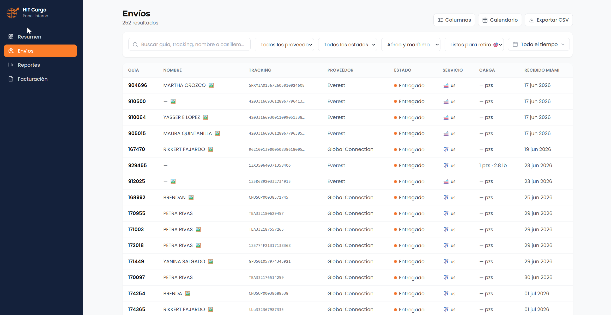
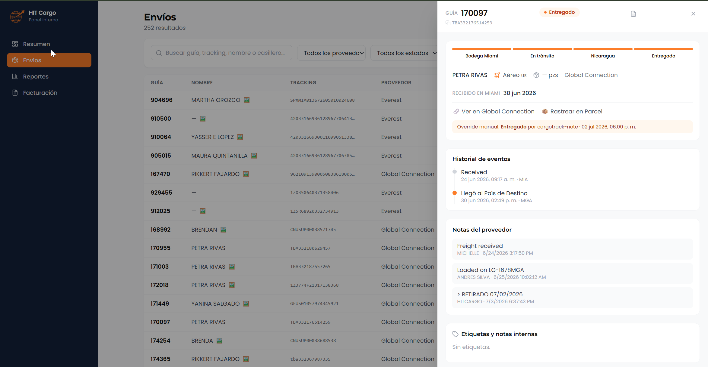
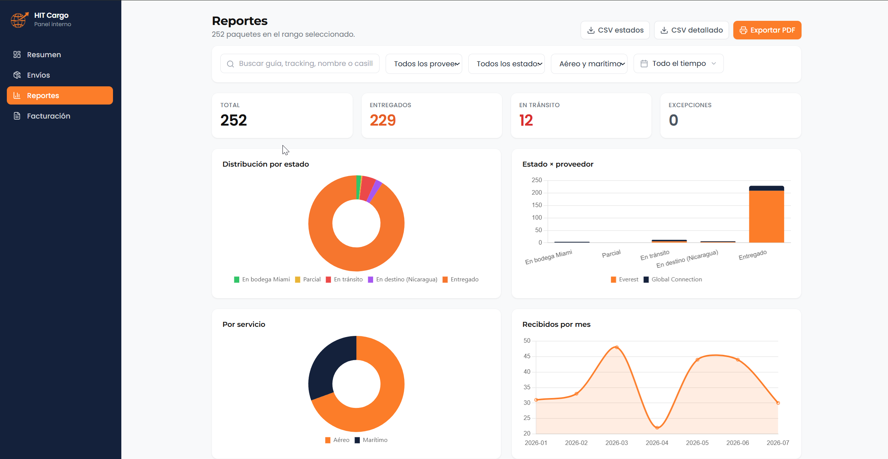

# HIT Cargo — Internal panel (`hit-panel`)

Operations dashboard for the HIT Cargo team: every shipment in one place, searchable by tracking number or mailbox, with manual status overrides when a carrier gets it wrong, team tags and notes, and a reports section with charts and CSV/PDF export for the accounting close.

The interesting part is what it *doesn't* have: no backend of its own. It's a static site that talks to [InsForge](https://insforge.dev) directly, and every access decision — who sees which rows, who can edit what — is enforced by the database through Row Level Security, not by client code. Writes go through `SECURITY DEFINER` Postgres functions instead of direct updates, so the browser never holds more power than a role should. The admin key that scrapes the carriers lives only in the `hit-ever` Worker; the panel never touches it.

- **Production:** https://hit-panel.pages.dev (login required — see screenshots below)
- **Stack:** Astro 6 + Preact + Tailwind, `@insforge/sdk` for auth and data, Chart.js for reports
- **Backend:** InsForge — the same project the `hit-ever` Worker writes to; the panel reads directly with the user's JWT and RLS decides what each role can see

---

## Screenshots

The production panel is behind login, so here's what it looks like. All data shown is test data — real shipments are redacted.

| Shipments list | Shipment detail + status override |
|---|---|
|  |  |

| Reports (Chart.js + CSV/PDF export) |
|---|
|  |

---

## How it works inside

There's no server for this panel. It's a static site (Cloudflare Pages) that speaks to InsForge directly: login returns a JWT, every query carries that JWT, and Row Level Security policies in the database decide which tables and rows each role (`admin`, `staff`, `viewer`) can touch. Writes — changing a status, adding a note — go through `SECURITY DEFINER` functions in Postgres rather than a direct `UPDATE`, so the client never gets more power than it should. The Worker remains the only thing that scrapes the carrier portals and the only holder of the admin API key; the panel never sees it.

---

## Run locally

```bash
pnpm install
cp .env.example .env          # PUBLIC_INSFORGE_URL and PUBLIC_INSFORGE_ANON_KEY
pnpm dev                      # localhost:4321
```

The anon key comes from the InsForge project already linked in `hit-ever/`:

```bash
cd ../hit-ever && npx @insforge/cli secrets get ANON_KEY
```

---

## Deploy

```bash
pnpm build
pnpm exec wrangler pages deploy dist --project-name hit-panel --branch main
```

Because the panel is static, the URL and the anon key are compiled into the bundle — if they change, you rebuild before redeploying; updating `.env` alone isn't enough.

---

## Documentation

Details live in [`docs/`](docs/README.md), numbered so you don't have to hunt: architecture, auth and roles, the data model with its RLS policies, per-section usage guide, and deployment.

---

*Code and comments in English; user-facing copy in Spanish.*
